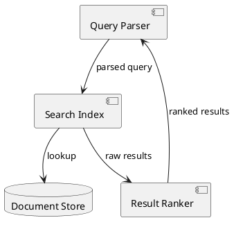

# Diagrams as Code

If the AI can't write it, it won't document it.

## Problem
Architecture diagrams live in visual tools like draw.io, Visio, or Confluence. The AI agent can't read them, can't update them, and can't generate them. When the agent builds a feature, the architecture diagrams stay frozen in their last manual state. Code and documentation drift apart immediately.

## Pattern
Use text-based diagram formats that the agent can generate and update. PlantUML, Mermaid, or Structurizr DSL are code. The agent writes them the same way it writes any other source file.

Combine with a text-based documentation format like AsciiDoc or Markdown. The agent generates prose and diagrams in a single commit. Architecture documentation stays in sync with the code because both are generated by the same agent in the same workflow.

This extends the "Text Native" pattern to structured documentation: not just text, but text that renders into diagrams, tables, and documents.

## Example

Instead of asking the agent to describe the architecture in words, ask:

```
Generate a PlantUML component diagram showing the building
blocks of the search module and their interfaces.
```

The agent produces:



This is version-controlled, diffable, and reviewable in a pull request. When the agent changes the search module next week, it updates the diagram in the same commit.

Compare that to a draw.io file sitting in Confluence that nobody will update until the next architecture review meeting.